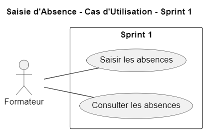

## 5. Branche Fonctionnelle

### 5.1 Carte d’empathie

#### Carte d’empathie Responsable des stagiaires

**Responsable des stagiaires**

- **Entend**
  - "Les formateurs veulent un outil rapide"
  - "L'administration veut des données correctes"

- **Dit**
  - "On a besoin d'un outil facile"
  - "Pas de temps à perdre pour chercher les absences"

- **Fait**
  - "Note les absences pendant la séance"
  - "Vérifie les présences avec une liste"

#### Carte d’empathie Formateur :

**Formateur**

- **Entend**
  - "Les élèves se justifient"
  - "Responsable de formation demande des données rapides"

- **Dit**
  - "Je veux un outil simple"
  - "Pas de perte de temps avec les absences"

- **Fait**
  - "Note les absences pendant la séance"
  - "Envoie les données à l'administration"

#### Carte d’empathie Apprenant

**Apprenant**

- **Entend**
  - "Les absences donnent des sanctions"
  - "Il faut justifier les absences rapidement"

- **Ressent**
  - "Inquiet des erreurs"
  - "Stressé par les conséquences"

- **Fait**
  - "Préviens quand je suis absent"
  - "Fournis les justificatifs nécessaires"

### 5.2 Définir le problème

Le problème est que les professeurs ont du mal à écrire rapidement et correctement les absences des élèves pendant les cours.

### 5.3 Cas d'utilisation général

Le cas d’utilisation général du projet est d’offrir une plateforme où les utilisateurs peuvent facilement saisir.

### 5.4 Cas d'utilisation (Sprint 1)

### 5.5 Cas d'utilisation (Sprint 2)

